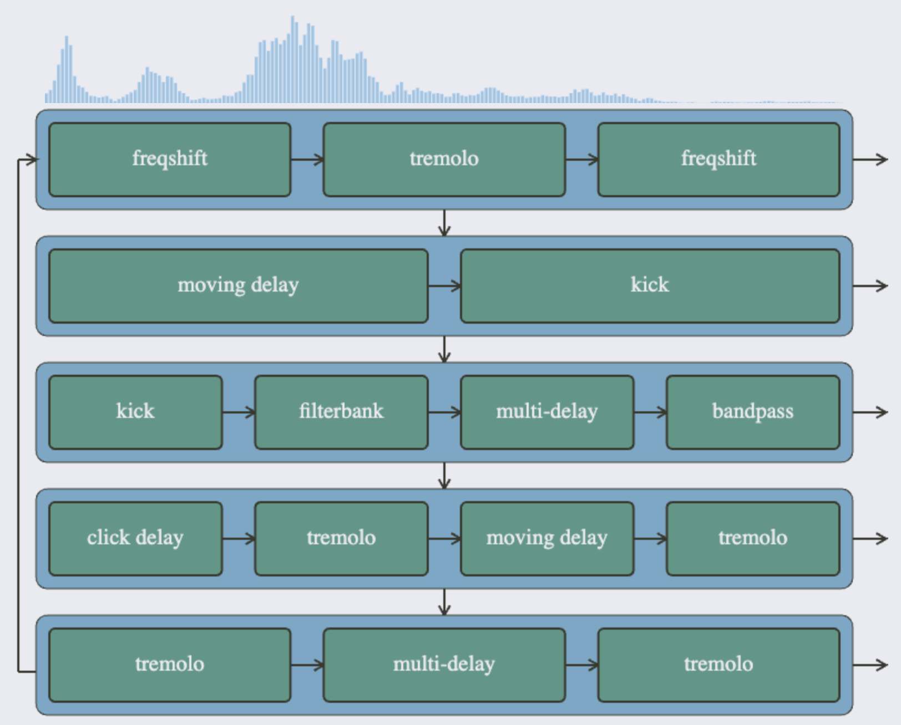

# Feedback network experiments
Web audio tests for feedback networks.

Try it out [tommudd.co.uk/feedback/feedbackweb/](https://tommudd.co.uk/feedback/feedbackweb/)

Creates up to 8 voices, each of which contains 2-5 audio effects.
Each voice feeds into the next. All voices are panned and mixed to create the output.

